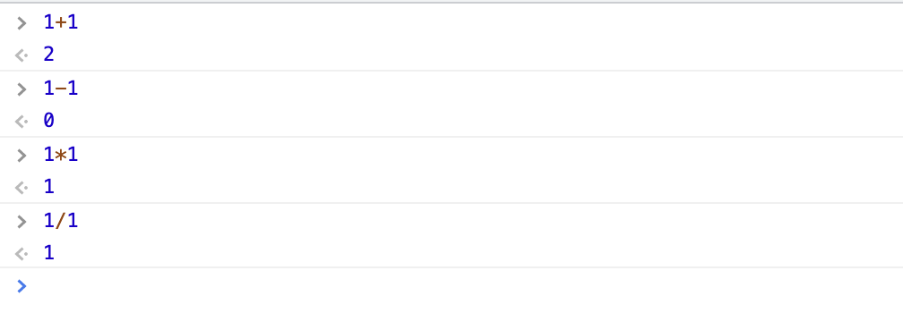

# 2.1 세미콜론, 주석, 들여쓰기

## 1) 세미콜론

세미콜론을 사용하는 이유는 코드의 명령을 마칠 때 사용한다.

```jsx
console.log('hello world'); console.log('javascript'); console.log('hello');
```

이런식으로 세미콜론을 써서 각 명령이 끝날 때 마다 명령을 마친다.

세미콜론을 쓰지 않는다면 에러가 나올수도 안나올수도 있다.

하지만 세미콜론을 쓴다면 에러가 나오지 않는다.
<br/>
<br/>

## 2) 주석

주석은 참고 사항을 쓸 때 많이쓴다.

```jsx
const money1 = '1,000,000';
//백만원

const money2 = '1,200,000';
//백 이십만원
```

이런식으로 //을통해 참고사항이나 코드가 뜻하는 방향을 적을 수 있다.

그리고 여러 줄 주석도 적을 수 있다.

```jsx
const money1 = '1,000,000';
const money2 = '1,200,000';

/*
money1 은 백만원,
money2 는 백 이십만원이다.
*/
```

이런식으로 /* */을 통해 여러개의 문장에도 주석을 적용 시킬 수 있다.
<br/>
<br/>

## 3) 들여쓰기

들여쓰기를 쓰는 이유는 가독성 때문이다

```jsx
if (condition) {
console.log ('hello');
}

//위 아래 두가지 코드를 비교해보자.

if (condtion) {
	console.log ('hello');
}

```

위에 코드를 비교 했을때 들여쓰기를 했을때가 가독성이 뛰어나기 때문에 들여쓰기를 하는 편이다.
<br/>
<br/>


---

# 2.2 문자열 기본 (따옴표, 백틱, typeof, escape)

## 1) 따옴표, 백틱

자바스크립트는 문자를 그냥 읽지 못한다. 

작은따옴표 큰따옴표 혹은 백틱을 활용하여 문자를 읽어야 한다.

```jsx
hello;
'hello';
"hello";
`hello`;
```

위에 보면  ' ', " ", ` ` 등을 사용해야 문자를 인식 한다는 것을 알 수있다.

단, 숫자는 ' ', " ", ` ` 등을 사용하지 않고 표현 할 수 있다. 

따옴표와 백틱은 문자와 숫자를 구별하기 위한 것.
<br/>
<br/>

## 2) typeof

typeof()를 사용하면 문자의 형태를 알 수있다.


위처럼 typeof(value) value값을 넣으면 문자가 어떤 형태 인지 알 수 있다.
<br/>
<br/>

## 3) escape
<br/>

---
# 2.3 문자열 합치기 (연산자)

자바스크립트의 +, -, *, /,와 같은 연산자로 연산을 할 수있다.



그리고 문자와 같은경우도 연산을 할 수 있다.


하지만 이렇게 하게된다면 띄어쓰기가 없는 조금 지저분한 문장이 될 수있다. 

띄어쓰기를 적용 시켜 보자.


이러한 방식으로 띄어쓰기도 적용 할 수 있다.
<br/>
<br/>

# 2.4 숫자 기본 (parseInt, NaN)

자바스크립트에서 '31'과 31은 다르다
```js
typeof('31')
//string

typeof(31)
//number
```
위와 같이 '31'은 string, 31은 number이다

그럼 연산자의 경우 어떻게 될까?

```js
'31' + 5
//315

31 + 5
//36
```
이와 같이 문자열로 인식이 되는경우에는 문자의 연산처럼 연산이 된다.
<br/>
<br/>
그럼 문자를 숫자로 바꾸려면 어떻게 해야할까??


**parseInt()** 는 문자를 정수로 <br/>
**parseFloat()** 는 문자를 소수로 바꿔준다 <br/>
**Number()** 는 문자를 숫자로 바꿔준다


```js
parseInt(3.14);
// 3

parseFloat(3.14);
// 3.14

Number(3.14);
// 3.14
```

그럼 숫자는 전부 Number()을 써야된다는 의문이드는데 결정적인 차이가있다.

```js
parseInt('3월');
// 3

Number('3월');
//NaN
```
parseInt()는 본인이 해석할 수 있는 최대한을 해석해주는 반면, <br/>
Number()은 NaN이 출력 된다 여기서 NaN은 Not a Number이다.
 
